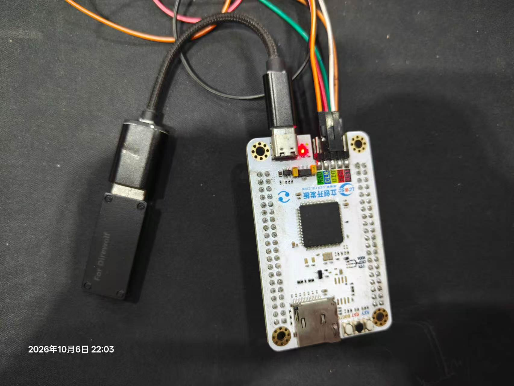

# F4_XBOX_USB：Xbox手柄数据转串口数据

如果对大家有用，可以点点Star:star::star::star:吗，求求了
本工程针对天空星 STM32F407VET6和飞智冰原狼2，其他类xbox手柄自行测试，采用接收器直连 USB OTG_FS。F407 解析标准 Xbox 按键、摇杆和扳机，以 USART1 发送串口数据。只包含Xbox标准按键，不包含陀螺仪和震动。

## 分层与接入

| 层 | 文件 | 职责 |
|---|---|---|
| Lib_OS | `os_receiver.c` | 入口覆盖、OS 资源绑定、READY 状态、软件定时器启动 |
| Lib_OS | `os_fault_hooks.c` | 链接器 wrap 接入生成的强 malloc/stack-overflow hook |
| Lib_App | `app_receiver.c` | 线程主体、原始消息处理、连接代号验证、采样发送/离线心跳 |
| Lib_Mid | `xbox.c` | 从 USB 传输中解析标准 Xbox 20 字节输入区 |
| Lib_Mid | `vofa.c` | 纯 C、小端 IEEE754 JustFloat 打包 |
| Lib_Mid | `gamepad_stream.c` | 纯 C 状态清零、拒绝旧连接报告、等待新报告恢复 valid |
| Lib_BSP | `usb_host.c` | HCD 回调、Host Core 适配、Xbox 厂商接口和非阻塞接收 |
| Lib_BSP | `uart_transport.c` | 注册 UART 回调、现有锁/信号量、DMA 缓冲区生命周期 |

所有应用 OS 对象都由CubeMX创建：三个任务、16×80 字节队列、互斥量、耗尽二值信号量、事件对象、周期定时器。

## VOFA 帧与发送行为

VOFA 参数：921600、8 数据位、Even、1 stop、无流控、JustFloat。

| 通道 | 内容 | 范围 |
|---:|---|---|
| 0 | LX | -32768～32767 |
| 1 | LY | -32768～32767 |
| 2 | RX | -32768～32767 |
| 3 | RY | -32768～32767 |
| 4 | LT | 0～255 |
| 5 | RT | 0～255 |
| 6 | buttons | 原始 16 位按键位图 |
| 7 | valid | 0 或 1 |

按键位：0/1/2/3 为上/下/左/右，4 Start、5 Back、6/7 左/右摇杆按下，8 LB、9 RB、10 Guide，11 保留，12 A、13 B、14 X、15 Y。

每帧为 8 个小端 float32 加 `00 00 80 7F`，共 36B。921600、8E1 下理论线时间约 0.430ms。这些整数转 float32 不损失精度；JustFloat 帧尾不是 CRC，当前只有 UART 偶校验。

正常发送由新有效输入触发。

## 板上联机步骤

1. 使用type-C转Usb的转接头，把手柄接收器连接开发板，核对开发板UART1接线。
2. VOFA按8E1+JustFloat打开对应串口；未收到有效输入时应看到valid=0和零值。
3. 让手柄与接收器无线连接。

部分代码使用codex编写
